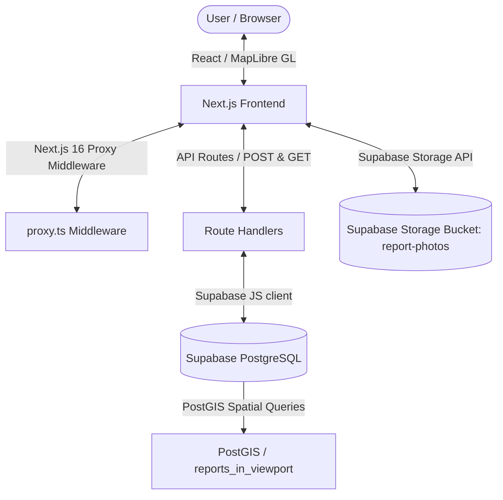
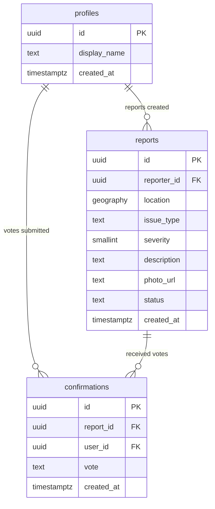
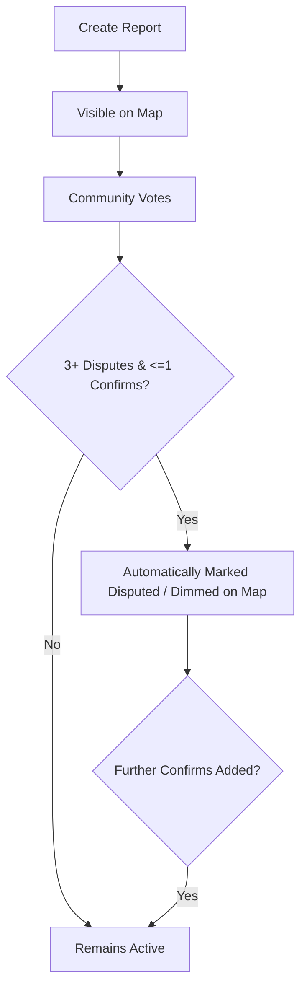

# Pave — Crowdsourced Sidewalk Accessibility Map

<p align="center">
  
</p>

<p align="center">
  <a href="https://nextjs.org"></a>
  <a href="https://typescriptlang.org"></a>
  <a href="https://tailwindcss.com"></a>
  <a href="https://supabase.com"></a>
  <a href="https://postgis.net"></a>
  <a href="LICENSE"></a>
</p>

**Pave** is a full-stack, responsive web application that empowers individuals to report sidewalk and entrance accessibility issues (e.g. broken pavement, missing curb cuts, stairs without ramps, blocked paths, or steep grades). Other users can confirm or dispute reports, constructing a real-time, crowdsourced accessibility heatmap. Designed specifically for wheelchair users, parents with strollers, and anyone navigating a city who needs to know which routes are actually passable.

---

## Table of Contents

- [Why Pave?](#why-pave)
- [Feature Showcase](#feature-showcase)
- [Technical Stack](#technical-stack)
- [Architecture & Data Flow](#architecture--data-flow)
- [Database Schema](#database-schema)
- [Report Lifecycle](#report-lifecycle)
- [Folder Structure](#folder-structure)
- [Getting Started](#getting-started)
- [Screenshots](#screenshots)
- [Troubleshooting & Gotchas](#troubleshooting--gotchas)
- [License](#license)
- [Author](#author)

---

## Why Pave?

Millions of people using wheelchairs, walkers, strollers, or mobility aids face inaccessible sidewalks every day due to obstacles like broken pavement, missing curb cuts, stairs without ramps, steep grades, and temporary blockages. Standard mapping applications (like Google Maps or Apple Maps) focus on vehicle navigation or general walking routes, often completely omitting street-level accessibility challenges.

**Pave** helps communities crowdsource real-time, street-level accessibility information. By pooling verified community observations onto a unified heatmap, Pave empowers users to plan routes confidently, while providing cities with clear, visual evidence of where accessibility infrastructure is failing.

---

## Feature Showcase

| Feature | Description | Technical Details |
| :--- | :--- | :--- |
| 🗺️ **Interactive Map** | View and report sidewalk accessibility issues. | Centered via Geolocation, rendering using MapLibre GL & `react-map-gl`. |
| 🔥 **Heatmap Density** | Switch between individual markers and a heat density map. | Utilizes client-side `supercluster` and native WebGL Heatmap layers. |
| 🔒 **Authentication** | Access reporting and voting via secure login. | Supabase Auth (Email/Password) with full localStorage mock support. |
| 📸 **Photo Upload** | Upload evidence photos directly during reporting. | Supabase Storage integration with automatic local Blob URL fallback. |
| 🗳️ **Crowdsourced Voting** | Users confirm ("Still there") or dispute ("Fixed") reports. | Upsert confirmation votes tracking unique `(report_id, user_id)` keys. |
| ⚙️ **Auto-Dispute** | Automatically hide/dim incorrect or resolved reports. | PostgreSQL database trigger checks dispute counts on vote updates. |
| 🔍 **Spatial Filtering** | Filter markers on the fly within the current map window. | PostGIS spatial queries filtering via bounding box bounding envelopes. |

---

## Technical Stack

- **Frontend**: Next.js 16 (App Router) + TypeScript + Tailwind CSS v4
- **Next.js 16 Proxy**: Network-level boundary routing and session refreshing via `proxy.ts` (Next.js 16's standard replacement for `middleware.ts`)
- **Styling**: Neo-Brutalist Visual Design (thick black borders, flat colors, offset drop shadows)
- **Map**: MapLibre GL JS via `react-map-gl` (with custom client-side clustering via `supercluster` & native WebGL Heatmap layers)
- **Backend & Database**: Next.js Server Route Handlers + Supabase (PostgreSQL with PostGIS extension + Row Level Security)
- **Auth**: Supabase Auth (Email & Password)
- **File Storage**: Supabase Storage (for uploading report photo evidence)

---

## Architecture & Data Flow



---

## Database Schema



---

## Report Lifecycle



---

## Folder Structure

```
pave/
├── app/                  # Next.js App Router (Layouts, Pages, API Routes)
│   ├── api/              # Route Handlers (reports, confirmations, seed)
│   ├── globals.css       # Global styles (Neo-Brutalist stylesheet)
│   ├── layout.tsx        # App root layout with AuthProvider integration
│   └── page.tsx          # Main interactive dashboard page
├── components/           # React Components
│   ├── AuthContext.tsx   # Supabase Authentication context
│   ├── AuthModal.tsx     # Neo-Brutalist SignUp / Login Modal
│   ├── FilterPanel.tsx   # Sidebar filtering options (Categories, Severity)
│   ├── Map.tsx           # Interactive Map component (MapLibre + Supercluster)
│   ├── ReportForm.tsx    # Pin-drop reporting form with image upload
│   └── ReportPanel.tsx   # Details panel for viewing & voting on selected reports
├── lib/                  # Shared Utility Modules & Constants
│   ├── constants.ts      # Colors, Icons, Issue details, and Severity descriptions
│   ├── mockDb.ts         # Global in-memory mock database & local voting fallbacks
│   └── supabase/         # Supabase Client initializations
│       ├── client.ts     # Client-side Supabase client
│       └── server.ts     # Server-side Next.js server client
├── public/               # Static assets (Logo, screenshots, fallback photos)
│   └── screenshots/      # Application workflow screenshots
├── supabase/             # Supabase Configuration
│   └── migrations/       # PostgreSQL initialization & storage SQL scripts
├── tsconfig.json         # TypeScript configuration
└── next.config.ts        # Next.js configuration (Turbopack, webpack settings)
```

---

## Getting Started

### 1. Database Setup (Supabase)

1. Create a new project in the [Supabase Dashboard](https://database.new).
2. Go to the **SQL Editor** in your Supabase project.
3. Open the migration files in this repository under `supabase/migrations/`:
   - [0001_init.sql](file:///supabase/migrations/0001_init.sql): Sets up tables (`profiles`, `reports`, `confirmations`), enables PostGIS, sets up spatial GIST indexing, adds RLS policies, triggers, and the viewport query function.
   - [0002_storage.sql](file:///supabase/migrations/0002_storage.sql): Creates the `report-photos` bucket and adds storage upload/view policies.
4. Copy-paste and execute the contents of both SQL files (first `0001_init.sql`, then `0002_storage.sql`) in the SQL editor.
5. In your project, go to **Project Settings** > **API** to copy the public URL and Anon key.
6. Copy the database service role key from the API settings if you need administrative capabilities (though it is not strictly required for standard app usage).

### 2. Mapbox Token Setup

1. Sign up for a free account at [Mapbox](https://www.mapbox.com/).
2. Create or find your default public access token on your account homepage.
3. The token should look like `pk.eyJ1Ijoi...`.

### 3. Environment Variables Configuration

1. In the root of your project directory, copy `.env.local.example` to `.env.local`:
   ```bash
   cp .env.local.example .env.local
   ```
2. Open `.env.local` and populate it with your Supabase and Mapbox keys:
   ```env
   NEXT_PUBLIC_SUPABASE_URL=https://your-supabase-project.supabase.co
   NEXT_PUBLIC_SUPABASE_ANON_KEY=your-supabase-anon-key-here
   SUPABASE_SERVICE_ROLE_KEY=your-supabase-service-role-key-here
   NEXT_PUBLIC_MAPBOX_TOKEN=your-mapbox-public-token-here
   ```

### 4. Running the Project Locally

1. Install dependencies (if not already done):
   ```bash
   npm install
   ```
2. Start the local development server:
   ```bash
   npm run dev
   ```
3. Open your browser and navigate to `http://localhost:3000`.

---

## Screenshots

Here are some screenshots showcasing Pave's interface, features, and Neo-Brutalist styling:

| Main Dashboard & Map | Reporting an Issue |
| :---: | :---: |
|  |  |
| **Placing Location Pin** | **Interactive Report Panel & Voting** |
|  |  |
| **Heatmap View Toggle** | **Neo-Brutalist Sign In Modal** |
|  |  |

---

## Troubleshooting & Gotchas

### Hydration Mismatch Warnings from Browser Extensions
If you see hydration error overlays or console warnings during local development like:
`A tree hydrated but some attributes of the server rendered HTML didn't match the client properties...` with elements showing extension attributes (like `cz-shortcut-listen="true"` from ColorZilla or attributes from Grammarly/password managers), this has been handled. 

The application uses **`suppressHydrationWarning`** on both the root `<html>` and `<body>` elements in [layout.tsx](file:///c:/Users/Sahu%20Ji/OneDrive/Desktop/REACT%20PROJECTS/PAVE/app/layout.tsx) to prevent React from throwing errors due to these client-side browser extension injections.

---

## License

This project is licensed under the MIT License - see the [LICENSE](LICENSE) file for details.

---

## Author

Developed by **Chhatrapati Sahu** ([Chhatrapati-sahu-09](https://github.com/Chhatrapati-sahu-09)).
